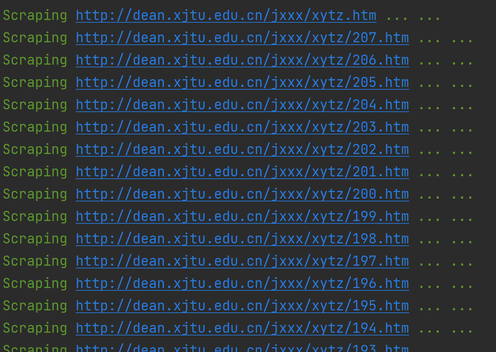
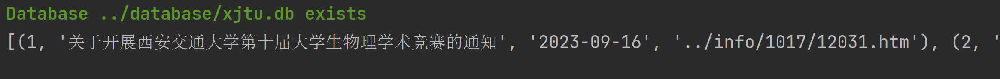
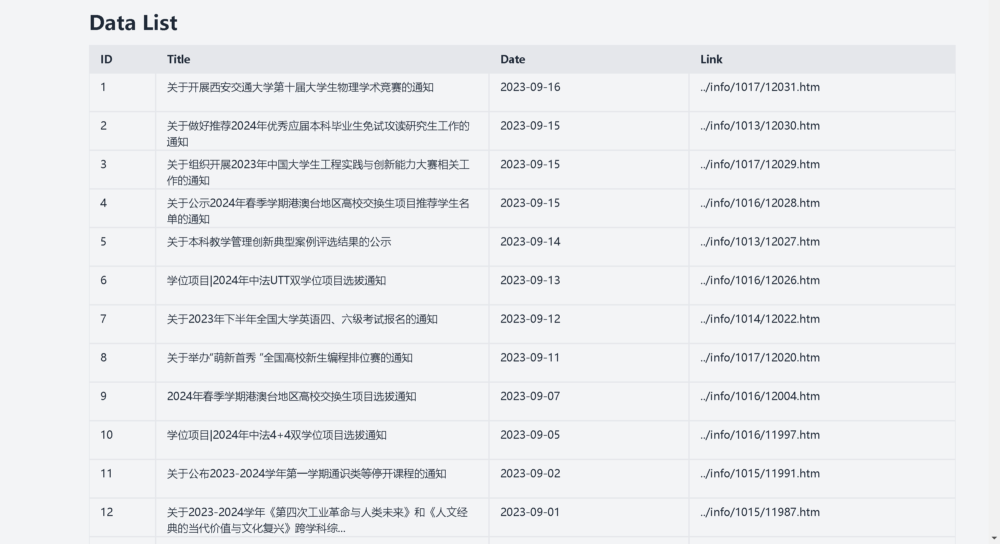
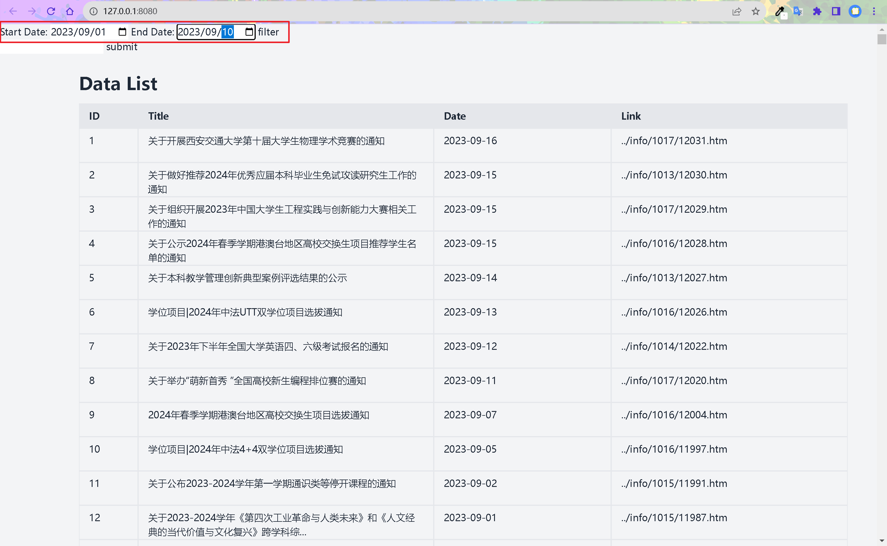
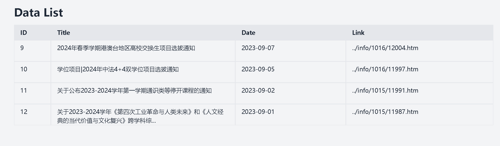
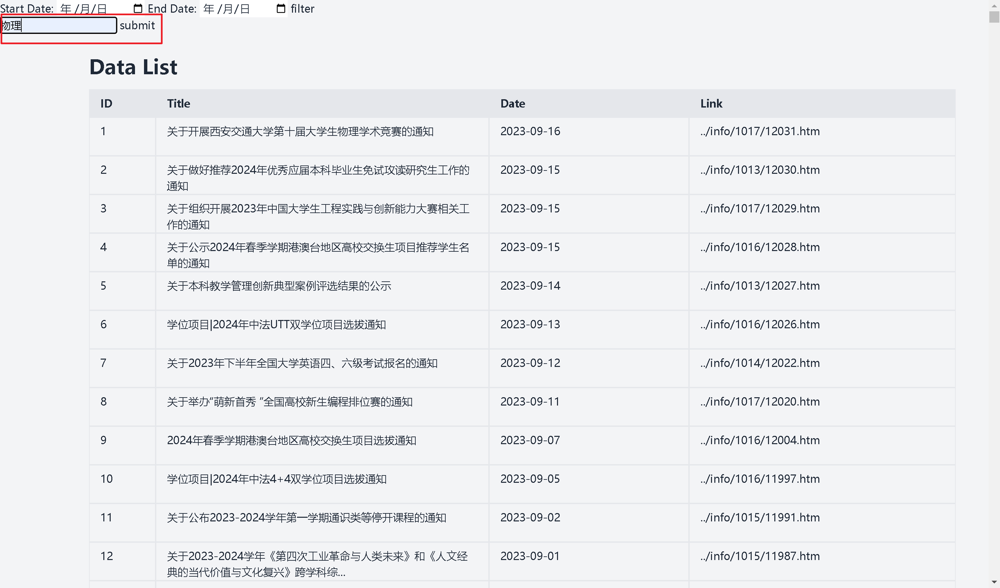
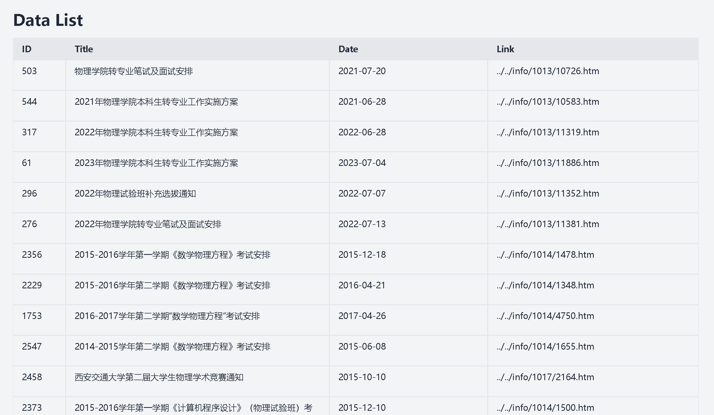

# 考核任务项目

能动B2104 杨牧天

***注：仅对项目过程进行简单展示，具体细节请参考源代码***

## 项目结构

```shell
xjtuEA:.
│  .gitignore
│  process.py # 初始化程序
│  README.md
│  run.py # 服务器启动程序
│
├─crawler
│  │  Crawler.py # 爬虫脚本
│  │  __init__.py
|
├─database
|  |xjtu.db # 数据库文件
│  
├─db
│  │  Database.py # 数据库相关操作类
│  │  DataSearch.py # 数据搜索相关函数
│  │  __init__.py
│  
└─templates
        index.html # 修改后的html模板
```

## 基础任务的完成

### 爬虫部分

爬虫部分采用异步协程爬取的库`aiohttp`，设定最大并行任务量为5个，通过观察不同网页请求地址构建不同页的地址，采用`bs4`解析爬取的`html`数据，将数据构造为要求格式并返回。

爬取过程如下图（正常运行）：

```python
loop = asyncio.get_event_loop()
d = Crawler()
result = loop.run_until_complete(d.main())
```



### 数据库部分

数据库部分采用任务要求的`SQLite`数据库，通过将数据库的创建，插入，搜索功能封装在类`Database`中实现数据库的创建。

数据库搜索展示如下图：

```python
database = Database("../database/xjtu.db") # 此处若数据库不存在会新建数据库
data = database.select_data("*", "xjtuEA", "id BETWEEN 1 AND 15") # 搜索id为1-15的数据
print(data)
```



### 服务器部分

服务器部分按照任务要求采用falsk框架搭建，基础部分仅有根目录`/`，通过简单的修改要求中所给的`html`模板（主要是为其添加列名以及设置间距），将从数据库中读取的数据展示在模板中。

如下图所示：



## 可选任务的完成

可选任务包括使用面向对象的方法进行编程，详见项目目录。第二点为实现筛选功能，通过在模板中添加`form`字段实现日期的选择并根据选择的日期区间在数据库中进行搜索并展示在网页上。

如下图所示：



筛选结果：




## 进阶任务

在要求的基础上，我通过自然语言处理实现了对数据的关键词搜索（可以与日期筛选结合，并根据关联程度排序），实现此功能的模块在`DataSearch`中

如下图所示：



排序结果如下：



